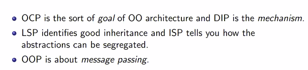
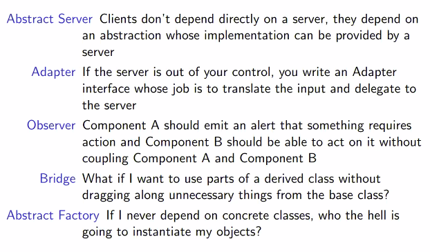
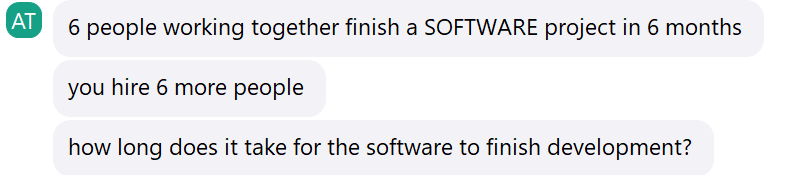

## 26-02-24
# Encryption

Problem at the backdrop
- Abdul and Bhim, star crossed lovers, want to send messages but Man-in-the-Middle
- look at the insides of API

Caesar Cipher:
- Simplest symmetric encryption (if we shift by some number other than 13)
- Param - number to be shifted by
- i.e, official Caeser has the key 13
- Security? Pretty bad. Only as secure as knowing a number 1-26. Can be broken by iterating through numbers

AES or Rijndale
- more convolutional method.
- `ciphertext = transform(text, key)`, `plaintext = inverse_transform(cipher_text, key)`
- uses matrix\* transformations (\* => reversible)
- uses a secret key
- more secure - significant task to guess key

What about a passphrase?
- Kerchkoff - a cryptosystem must be secure even if everything about the system except key is public knowledge
- Doors of Durin - bad; arcane knowledge accessible. What if the dwarves used hashing?

Hashing
- function such that 
	- data1 = data2 => hash(data1) must be = hash(data2)
	- data1 != data2 => hash(data1) very preferably != hash(data2) (avoid collisions) - effect of having a smaller range than domain
- one way, not easily invertible
- bad hash - number characters, open door if sum is 71 (easy to fool, many collision)
- useless unless password is strong though - if you broke into a db and saw multiple similar password, you could guess at the hashed value.
- Rainbow tables can be created based on popular passwords - using statistics. so,

Salt
- Beat statistics. Generate random string & add to password before hashing a common password
- completely random. Salt stored in database - not harmful to be seen
- not worth it for someone to figure out salts
- **bCrypt/Blowfish** - 22 character salt + full hash

The trouble with Symmetric encryption - key distribution
- If Abdul is an investigative journalist? Informant must be anonymous. 
- often, the first contact with any system is going to be anonymous
- you have to deal with keeping anonymity on internet

Asymmetric encryption! 
- abdul locks the box. sends to bhim who locks with a second one. abdul unlocks his end and then bhim unlocks his to get the content
- pretty expensive
- process to generate a pair of keys. one to encrypt and one to decrypt
- abdul gives the public key, you encrypt it into a token, abdul decrypts using his private key (never shared)
- doesn't matter who gets the public key. abdul is not scared of spam
- this is more like adbul sending out locks and keeping the key 

Think about the possible attack vectors
- Enter a system unauthorised
- read a message you're not allowed to
- modify/replace a message in transit (identity theft of sender or receiver, shooting the mailman)

How do you know that someone is the true sender? message is not sent by dwight
- *Signing* 
- what kinds of documents need signatures?

Needs
- good hashing function that generates a compact hash (md5) (its param is shared) - small changes in input have large changes in output - follows rules set by randomised key, that are irreversible.
- good asymmetric encryption technique (RSA)

Steps
- generate an md5 hash of  your message 
- generate an RSA key pair
- messaging
	- encrypt the hash of the message using priv_key to et a sign
	- if the decrypted sign (using pub_key) is exactly the hashed message, it has not been changed
	- message is sent unhashed with sign and public key
- if hacker receives the triples? they get the message, the output and one of the inputs of RSA
- RSA should be good at keeping the private key safe given all that info - Kerchkoff

This `signing` underpins JWTs. 
- header
- payload
- *signature*
can be signed with RSA, HMAC, base64 encoding - makes it possible to sign via hashing or RSA
- RSA used to verify identity. identity providers maintain a list of public keys for easy verification

OpenID connect specifications
 - aruvi.com / \_known_endpoints_ - outsource password checking, authentication to identify provider using JWT standard

RSA used for two applications - complementary tasks
- to talk to Abdul secretly
- to make sure Abdul is Abdul

task of RSA key generation (pair generation)
- find a combo `e, d, m` such that $(m^e)^d = m(mod n)$ the remainder given by m is the same as the remainder of $(m^e)^d$ by n. provable by euclid's algo and other generalisations - see derivation on RSA wiki
- relatively modern algos whose large prime numbers p, q
	- compute p*\q - this is n
	- Totient function = lcm(p-1, q-1)
	- choose a convenient e
	- choose a convenient d
	- (if d is chosen and used to calculate e, decryption is easier)
- e, d interchangable - public key and private key generalisable without loss of generality due to laws of exponentiation

Think about the HTTPS handshake
- info sent must be encrypted. Symmetric keys must be exchanged - once keys are exchanged, symmetric is amazing
- Sequence of ops:
	- client (browser) is server's public key and certificate. Certificate - proof of identity - given by GeoTrust. signed by GeoTust's private key. Browser verifies certificates using public key. GT locks all certficates & gives browsers the key to check that the lock is right. after decrypting the encryption that could only have been created by GeoTrust, the browser reads 'Google certificate'. The certificate is refreshed after a certain validity period. What stops my broswer from relaying the certificate to pretend to be google? Combination of the need to be registered with DNS, respond to request, and have the cert (maybe) adds some security
	
	
	
	- provide client details encrypted with public key of server. Ask for credentials for this session
	- server then decrypts using private key. 
	- client creates a symmetric encryption (secret key) for this session.
	- incognito browser would ensure to kill the session when the window is closed
- session ends if anything sus happens or if session actually ends
- asymmetric encryption for trust and symmetric encryption for secrecy
## OAuth
allows one to register a third party app with your account, granting limited access. third party is main one's client in this case
- provide a way for LeafScroll (3rd party) to authenticate itself for access to Podhaar (account) to access content from the app

Auth stands for authorisation, not authentication. uses JWTs as standard token format.

OpenIDConnect - provides authentication using similar mechanisms

**Note:** in cryptography, time is of crucial concern. Some things are time sensitive. However, since time is the main safeguard, efficient quantum computing can destroy bets of irreversibility

SSH
- means to communicates, remote login & authenticate
# REST
- set of constraints a good API must obey
- Stateless - each request must carry all info, including authentication details (if sensitive resource is being accessed). Does not keep track of sessions or global state. Each request is self contained. Advantage - scalability & parallelisability
- implies idempotent requests - making the request 1000 times is same as making it once - independent result each time

>Look up
- [ ] *the SSH handshake* - how does it compare to HTTPS
- [x] What stops my browser from relaying the certificate to impersonate google? - replay attacks
- fingerprinting - something like a timestamp to say 'I sent this at this time' 
- [x] function-as-a-server
	- [ With FaaS, you can divide the server into functions that can be scaled automatically and independently so you don’t have to manage infrastructure.](https://www.ibm.com/topics/faas)
- [x] nodempotence
- [ ] CAP theorem
- [ ] Can two public keys have a common private key? (No)

## 01-03-24

[Four easy reads to understand distributed systems issues](https://blog.separateconcerns.com/2015-07-07-four-easy-reads-distsys.html)
[Brewer's conjecture - CAP theorem](https://dl.acm.org/doi/10.1145/564585.564601)
[Why Logical Clocks are Easy](https://queue.acm.org/detail.cfm?id=2917756)
# Distributed systems
what changes and why should I care?

Robustness, Availability, Throughput, Latency - delicate balance thrown into chaos with the advent of DS

DS 
- group of autonomous nodes (systems) coordinate to perform a task
- eg distributed MapReduce
- changes
	- faults are easier to manage when there is a common clock, memory address space, access to mediator b/w processes
	- Can't use Ostrich method of deadlock recovery - do nothing - wait for a restart; there is now a **network barrier**
- Implicit, basic things are no longer guaranteed - time? to what clock will you synchronise events? what is the sequence of events? debugging?
- IPC become RPC - ask another system's memory to execute on your behalf
- Finally have to deal with hardware - there is a physical hard lower limit on latency
- Systems are going to fail. Decide on which parts are too precious to be ambiguous. It's better to build systems that **fail very fast and very loudly** - be vocal about the fact that constraints are not met. Provide recovery options

Failures Happen at the level of the wire

8 (debunked) Fallacies
- Application programs take reliability of network via HTTP (a leaky abstraction over TCP) for granted. TCP is what knows what exactly went wrong.
- Latency. Routing essential to find servers in proximity- immense amount of distance to be covered (even underwater)
- Bandwidth - right amount of data to send, load balancing.. an upper limit to how much info can be sent given hardware requirements & time limit
- Cannot assume that any unsecure data is not going to be misused. The network is a huge part of the system out of one's hands
- Changing topology- accidentally or deliberately, nodes are continuously added & removed. Affects scaling. Topology outside the system is entirely uncontrollable. Determines what latency & bandwidth is going to look like
- Multiple administrators - there is no one person who knows everything about the system. monitoring now needed
- Transport cost exists - requires a lot to keep a system running - time, security, risk, latency....
- No homogeneity - hardware, local environment, capacity, protocol

Failure is now a probability, not a possibility. all happy families are the same - boring. There are many interesting ways to be tragic
All things pulling at each other, impossible to optimise all at once

#### Two Phase Commit
- ensure that a process in a DS is an atomic transaction (operations that are collectively committed OR aborted)
- 1a - coordinator queries is 'ready to commit'
- 1b - participants vote
- 2a - coordinator tallies vote
- 2b - if all agree, coordinator instructs to commit; if even one says no, all roll back

Requires write-ahead capability

*✨Issues✨*
- need for coordinator - what if something goes wrong on coordinator's end; but the identity of the coordinator does not matter
- Blocking protocol - one problematic component/coordinator can block all other functional processes (who puked on the ride?)
- many steps & complicated dance. Forces asynchronous participants to behave synchronously. Requirements of synchronocity are very hard to fulfil in an asynchronous systems - introduces unreasonable limitations

A way to demarcate sections of the system too sensitive to take lightly - bank money transfers

[The most natural way to model real life systems may not be the synchronous way](https://www.infoq.com/articles/webber-rest-workflow/)
- Starbucks order - short synchronous phase (payment; too important to be async) + long asynchronous phases (making drinks; you're not waiting at the counter for that)
- 'integration' of system components via messaging. How do components of a workflow orchestrate to get something done while remaining independent? (questions worth asking)
- the processes here - placing order, paying, coffee creation.. these are not very obvious state changes in an async system4

You need to pick and choose that parts of the workflow that require consistency (2PC) (payment), those that require availability (Swiggy restaurant list- doesn't matter if it's not always right)
#### ACID vs BASE
for systems where transactions are important. 
Atomic, Consistent, Isolated (from effects of others), Durable
in tandem with
Basically Available, Soft-state, Eventually Consistent

Impossibility result - [Alan Turing's Halting problem](https://www.youtube.com/watch?v=eqvBaj8UYz4) - a hard limit on what engineers can do. Similarly,
**CAP** is an impossibility result - If you care about tolerance to network **partitions** (is a modern non-negotiable) (graph-type partition) (inability of one/more nodes to connect to the network)
You have to forfeit **Availability** - now you can guarantee system backups to ensure **Consistency**. Swiggy's restaurant list prefers availability. YouTube forfeits availability for consistency when populating homefeed updating views, chooses consistency when playing a video. Instagram - liking a (cached) photo causes cache to reload & lose update.

Consistency - can be strong (every update recognised by everyone else), weak (some parts care more about showing data than accuracy of data), eventual (guarantees that an update is eventually made or will fail loudly).
Cache - eventual consistency model.

>Lookup
- [ ] Admiral Grace Hopper & COBOL
- [ ] Levels of Consistency
- [ ] [Why Logical Clocks are Easy](#01-03-24)

## 04-03-2024

when complexity increases, architecture dominates code in projects.  OOPS helps you model things in the real world especially if they have a lot of moving parts that interact.

Now, programs solve more general, business logic rather than highly technical. Need to be readable to us primarily, machines obviously but secondarily. OOP - robust & powerful means of expressing real world objects, states, processes.

Bad code gets written. 
Rotting design symptoms - Bob Martin
- rigidity (difficult to change even in simple ways - lot of coupled (dependent) components, leading to misbehaviour) - changing the color in one room requires changes everywhere else
- fragility (breakable) - changing the colour of a window leads to breakdown in china - affects the speed of fix (like hydra)
- immobility (non reusable) - if reusability is bad, code must be changed in multiple places - cannot use code from one project
- viscosity (design & environment) - design is practically difficult to adhere to; effect of the environment - devs write code in a way that minimises the time they have to spend (code reviews, compilation time)

Building blocks:
## Open-Closed Principle
- Don't change something that was already working to bring in a new change
- design for extensibility without modification
- Identify contract being provided - if a method can perform a password authentication, moving to a different decryption algorithm does not result in a change in the contract. Contract? a method that takes a certain inputs & performs certain outputs
- aka polymorphism (consistent, unmodifiable interface)
- separates higher abstraction (less likely to change; interface) from often changing (low in inheritance hierarchy)

[Yahtzee](https://pi.math.cornell.edu/~mec/2006-2007/Probability/Yahtzee.htm)

OOP languages are built on abstraction - compiler checks solidifies guarantees about the language

## Liskov substitution principle

Barbara Liskov - developed the idea of the abstract datatype
- Liskov substitution principle - tells you what inheritance is supposed to be - the act of creating derived classes that can be substituted for their base classes
- The child class must satisfy the contracts set by the parent

A contract is more than just an argument list.

Inheritance is a relationship where you can fill in 'child instance IS a parent instance'; the child is a specialisation of the parent.

Consequences of a statement/relationship like that? 'Square' as a child of 'Rectangle' is a fundamentally bad abstraction to be applying. - [see](https://isocpp.org/wiki/faq/proper-inheritance#circle-ellipse-nonintuitive)
## Dependency Inversion Principle

What should you abstract, when and how.?
- Higher level module must not depend on a lower level module. Should rather depend on a higher level abstraction (that has the signature), which is conveniently filled in by the lower level.
- Random library - don't depend on it, depend on the abstracted signature. What if you have multiple generators?
- Known as dependency injection
- Don't know what the implementation is going to be - this is injected at runtime, into the expected interface

Abstractions are the Hinge points that represent places where the design can be OCPd

## Interface Segregation Principle

if a class has several clients, create specific interfaces for each client & multiply inherit into the class (rather than loading the class with all methods at once)

Decide abstractions based on requirements that change together.

## SRP
Separation of concerns - build separate packages for separate concerns

Design patterns implement the above principles in commonly reused ways.

Abstract factory - the one place where DIP violated - one place where things are actually instantiated; other parts of the program ask for these. (SpringBoot dependency injection uses this, and the server facade pattern - intercepts request & injects concrete implementation)

> Read
- [ ] preconditions & postconditions (LSP)
- [ ] [Robert C Martin](https://wnmurphy.com/assets/pdf/Robert_C._Martin_-_2000_-_Principles_and_Patterns.pdf)'s article
- [ ] Wiki article for each principle
- [ ] Gang of four 1998 book - design patterns
- [x] Rectangle and square C++ (previous)
- [ ] [Yahtzee git](https://github.com/aruvi-py/prodapt-bootcamp/tree/main/calibration/src/yahtzee)
- [ ] [og SOLID - Robert C Martin Principles & Patterns](https://wnmurphy.com/assets/pdf/Robert_C._Martin_-_2000_-_Principles_and_Patterns.pdf)

## 08-03-24
class produces an instance that is a single instance. therefore classes are names in singular

overloading (implementations for diff param list) does not have something to do with inheritance. overriding (override superclass implementation) does.

enumerated types - a value can take on any of a short list of named constants. Aruvi's enum is the factory. lets them depend on high level abstractions. everything is initialised here and no where else.

allows them to write generic code elsewhere.

whatever concretely inherits an interface must concretely implement an abstract method. eg 'for Category c in catgories' without worrying about all the different kinds

Aruvi decoupled 'Yahtzee' and 'FullHouse' by creating a (more abstract) parent both of them can depend on. Now after the dependency on FullHouse is removed, who is going to instantiate the FullHouse? Exactly one guy - Category - factory instantiates and provides to whoever calls. enables dependency on high level abstraction. allows Yahtzee to not care about the category. Allows you to control which parts of the code or requirement changes.

# Waterfall model

- simple
- iterative/ predictive
- defined phases
- interaction with customer only at the end

[Paper by Winston Royce](https://www.praxisframework.org/files/royce1970.pdf) - says the waterfall model doesn't work. 'I believe in this concept, but the implementation described above is risky and invites failure'

'Something that feels primitive, low tech to us, was at its time, at one time, cutting edge technology' Primitive tools were made by people who needed them.

Proposed to deal with the specific risks of development of large software systems. Most important one? cost of discovering a bug. There is a very strict hierarchy through which the cost of discovering a bug increases exponentially.
During the requirements extraction, a misunderstanding, i.e, minutes of a meeting must be fixed. takes x to do so.
At the time of design? If you discover you've misunderstood, you would have to go back, speak, clear.... 10x. your working design is resistant to change.
Now, at the time of writing code, you discover the bug - can't fix it right there! you'll have to go back, redesign, reimplement it. 100x
testing?

difference between discovering between before and after release is difference between unicorn and bankruptcy.

every phase has associated documents to reduce risk as much as possible.
create pilot models.
involve the customer

One in a long line to criticise! Says waterfall model is not a model, simply what turns up after applying SE organisation to a primitive idea. All interventions he adds on are in consideration of the humanness of people. (why else explicitly require documentation & testing)

## Agile
Holes in this are addressed by the [Agile Manifesto](https://agilemanifesto.org/)

'waterfall model' is often an homonym of 'bureaucratic structure'

[Conway's law](https://en.wikipedia.org/wiki/Conway%27s_law) - "Organizations which design systems (in the broad sense used here) are constrained to produce designs which are copies of the communication structures of these organizations."

What holes in waterfall?
- software for documentation - have working code for clarity
- contracts & docs - keep the customer in the room
- respond to change than have a perfect plan

Software engineering was in a crisis - software gets delayed. Focus on rigid structure than development.

1 year

give more power to the individual who increases the energy of the work - build around motivated individuals for better pacing. trust the cowboy coder & put restrictions, give encouragement to them, they will get the job done. Don't -make the wrong person write the wrong thing (uml).

customer in the room

Talk is cheap - show me the code

create a sustainable system to work at a constant pace indefinitely. A day is only 6 hours - respect human limitation.

**Sprint** - team works to finish set amount of work. work guided by realistic technical estimates.

Design is still important

Harness the specific type of laziness in programming to put it to good use

Amazon - 2-pizza team - 8 people (not bigger than one that can be served by 2 pizzas if working late) + no imposed structure - decided by software design

Adjust & readjust behaviour by reflection - keep the waterfall out. Keep track of physical _and_ human processes

prototype should be killed

Agile tools often undermine the principles & problems agile tries to solve. It's not easy to create tech solutions to social problems - at the end of the day, waterfall model is a social problem. Clash between the developer who wants freedom & the manager who wants results.

Example - IVF - nobel prize for medicine. credited for trying to solve the problem of infertility. Does the problem of infertility really need tech solution & did it actually solve the problem? Simple solution - adopt somebody. or be fine with it. Core social problem; put back on top of tech solution! those who want the solution are denied it. It's tricky to develop tech solutions for social problems.

Point of the sprint - retrospection for improvement - did I have a bad week or am I having a bad process?

> Read
- [ ] political clashes between free, proprietary software, role of SE in a changing world [Origins and History of Unix](http://www.catb.org/esr/writings/taoup/html/historychapter.html) 
- [ ] The Mythical Man Month - Fred Brooks
- [ ] [12 principles of agile](https://agilemanifesto.org/principles.html)
- [ ] [The Demise of the Waterfall Model Is Imminent](https://queue.acm.org/detail.cfm?id=971573)
- [ ] Body, Reproduction and Technology: Local Subversions and Global Regressions by Chayanika Shah

Additional starting points
- [ ] [Joel on Software](https://www.joelonsoftware.com/2002/06/12/strategy-letter-v/)
- [ ] [Martin Fowler on waterfall](https://martinfowler.com/bliki/WaterfallProcess.html)
- [ ] This is the bare minimum every programmer needs to know about unicode
- [ ] Designing Data Intensive Applications (?)

## 05-03-2024
# Gen AI
Eliza - looking for keywords, pattern matching; abstract away input/ouput from algorithm. Deterministic.

Joseph Weizenbaum

Parry - Dr Kenneth Colby - turing test as a tool to explain our own understanding of consciousness.

Turing predicted we'd be able to pass the test at 10^8 memory, 70% of the time - we have not.

The problem of consciousness. Leibniz

How do we define understanding? Can a transformation and pattern matching algorithm be called understanding?

Prompt engineering. If you give it a bunch of ip/op you're happy with and end it with an ip, it is likely to give an output you're happy with.

Chauvinism/anthromorphism - attributing human characteristics to things that are decidedly not human. You could pass the turing test with emotional manipulation.

Is 'understanding' a meaningful question to ask? We understand intelligence in human centric terms. Marty Neve - 'no interest in commnication; stylistic mimicry'.

Loebner prize. 

Can we come up with reasoable methods to interact with genai while it undergoes paradigm shifts?
